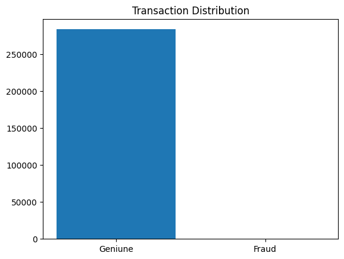
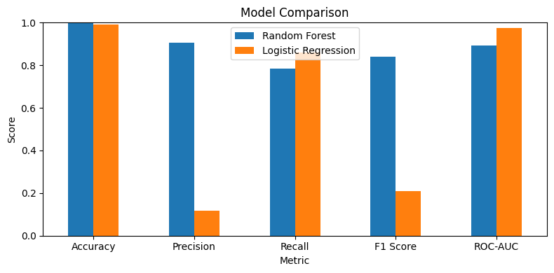

# Credit Card Fraud Detection

## 📌 Project Overview

In this project, I built a machine learning model to detect fraudulent credit card transactions.

The main challenge was the **highly imbalanced data**, where genuine transactions were much more common than fraudulent ones.

## 🛠️ Tools Used

- Python
- Pandas
- NumPy
- Matplotlib
- Seaborn
- Scikit-learn
- SMOTE

## 🔍 What I Did

- Cleaned and explored the dataset
- Checked missing and duplicate values
- Analyzed class imbalance
- Scaled the transaction amount
- Used **SMOTE** to balance the training data
- Trained Random Forest and Logistic Regression models
- Compared both models using Precision, Recall, F1-score and ROC-AUC
- Used confusion matrices to evaluate the models

## 📊 Model Comparison

| Metric | Random Forest | Logistic Regression |
|--------|-----------------:|-----------------:|
| Accuracy   | 99.95% |     | 98.97% |
| Precision  | 90.52% |     | 11.84% |
| Recall     | 78.36% |     | 85.82% |
| F1 Score   | 84.00% |     | 20.81% |
| ROC-AUC    | 89.17% |     | 97.33% |

Random Forest gave a better balance between **precision, recall and F1-score**, so I selected it as the preferred model for this project.

## 📈 Visualizations

### Transaction Distribution

### Random Forest Confusion Matrix

### Logistic Regression Confusion Matrix

### Model Comparison

## 📓 Project Notebook

[Open the Jupyter Notebook](Credit_Card_Fraud_Detection.ipynb)

## ⚠️ Limitations

The dataset contains anonymized features, and the project does not include real-time fraud detection or deployment.

## 🚀 Google Colab

[Open the project in Google Colab](https://colab.research.google.com/drive/1J-ozXwUTobs4zJab9bwu6PtpRHradnxs?usp=sharing)

## 👨‍💻 Author

**Shaheen Khan**
